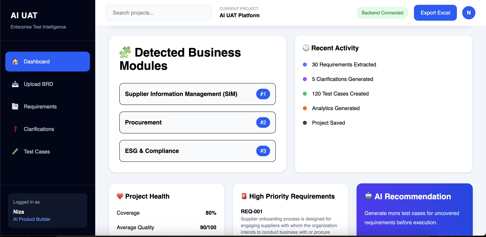
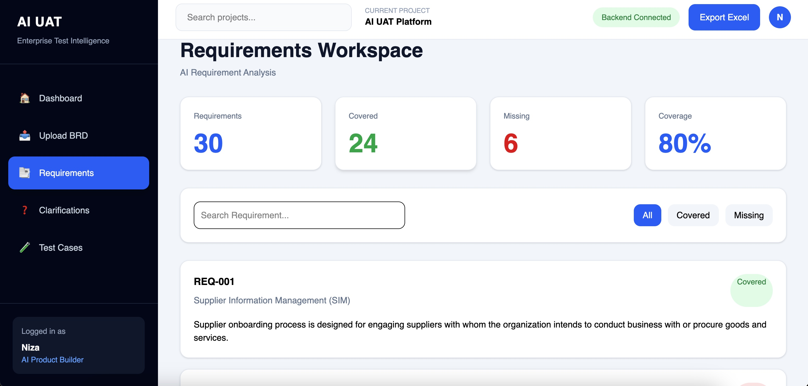
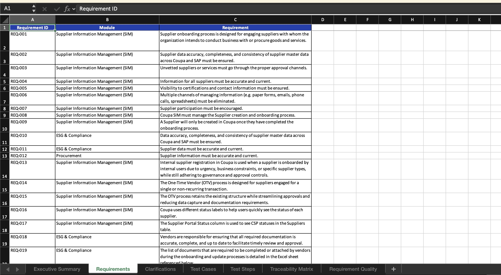

Automating Business Requirement Analysis & User Acceptance Testing using Generative AI

Transform Business Requirement Documents (BRDs) into structured requirements, AI-generated clarification questions, comprehensive UAT test cases, traceability matrices, analytics dashboards, and an intelligent AI Copilot.

📖 Overview

The AI UAT Platform is an enterprise-grade AI application that automates the User Acceptance Testing (UAT) lifecycle using Large Language Models (LLMs) and Retrieval-Augmented Generation (RAG).
Instead of manually reading lengthy Business Requirement Documents (BRDs), identifying requirements, creating test cases, and maintaining traceability, the platform performs the complete workflow automatically within minutes.
Designed for Business Analysts, QA Engineers, Test Managers, and Product Teams, the platform improves productivity, reduces manual effort, and increases testing coverage.

🎯 Problem Statement

Traditional UAT preparation requires teams to:

Read 100–500+ page BRDs
Extract functional & non-functional requirements
Categorize requirements into business modules
Identify ambiguities
Create clarification questions
Design UAT test cases
Maintain Requirement Traceability Matrix (RTM)
Measure testing coverage

This process often takes days or weeks.

The AI UAT Platform reduces this effort to minutes using AI.

✨ Key Features
📄 Smart BRD Upload Supports:

PDF,DOCX

Automatically parses documents and extracts structured text for downstream AI processing.

🧩 Business Module Detection

Automatically identifies enterprise business domains such as:

Procurement
Supplier Information Management (SIM)
Contract Management
Sourcing
Receiving
Invoicing
Spend Analytics
ESG & Compliance
Fraud Detection
Community AI
Savings Management
Contingent Workforce
🤖 AI Requirement Extraction

Uses LLMs to transform unstructured BRDs into structured business requirements.

Each requirement includes:

Requirement ID
Business Module
Priority
Requirement Type
Requirement Description

Example

REQ-001

Module:
Supplier Information Management

Priority:
High

Requirement:
Supplier onboarding process should support approval workflows.

❓ AI Clarification Question Generation

Generates intelligent clarification questions for ambiguous requirements.
Example:
Requirement:
Supplier onboarding should follow approval workflow.
Generated Questions:
Who approves suppliers?
Can approval be bypassed?
What happens if approval is rejected?
Is supplier onboarding mandatory?
What SLA applies?

🧪 AI Test Case Generation

Automatically generates:

Positive Test Cases
Negative Test Cases
Boundary Value Cases
Exception Scenarios
Alternate Flow Scenarios

Each test case contains:

Test Case ID
Preconditions
Test Steps
Expected Result
Requirement Mapping
Priority

🔗 Requirement Traceability Matrix (RTM)

Automatically links:

Requirement
        ↓
Generated Test Cases
        ↓
Coverage Status

Provides:

Covered Requirements
Missing Requirements
Coverage Percentage
Linked Test Cases

📊 AI Analytics Dashboard

Interactive dashboard displaying:

Total Requirements
AI Clarification Questions
Generated Test Cases
Business Modules
Coverage Percentage
Covered Requirements
Missing Requirements

Also includes:

Module Distribution
Requirement Priority Distribution
Project Health
AI Recommendations
📋 Requirements Workspace

Dedicated workspace to:

Browse Requirements
Search Requirements
Filter Covered/Missing
View Requirement Details
Inspect Linked Test Cases

🤖 AI Copilot (RAG Powered)
Ask questions about any requirement.

Example:

Explain this requirement.
Why is this required?
What business rules apply?
What risks exist?
How should QA validate this?

The AI:

Searches the uploaded BRD
Retrieves relevant document chunks
Uses Retrieval-Augmented Generation
Responds only using the uploaded BRD
Prevents hallucinations

📈 Excel Export:

Exports generated test cases into a structured Excel workbook for enterprise QA teams.
